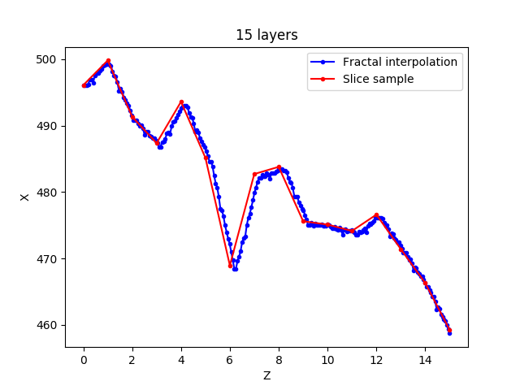
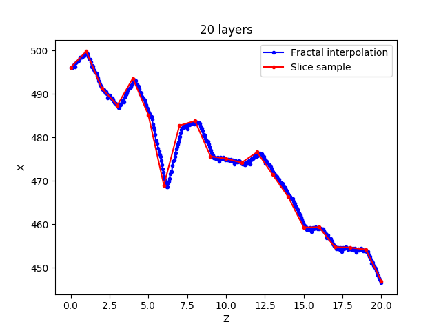
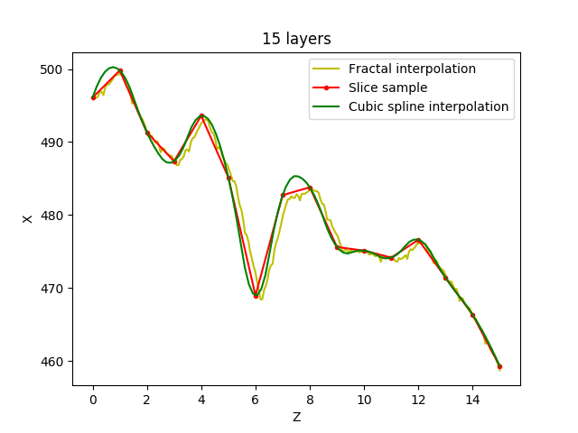
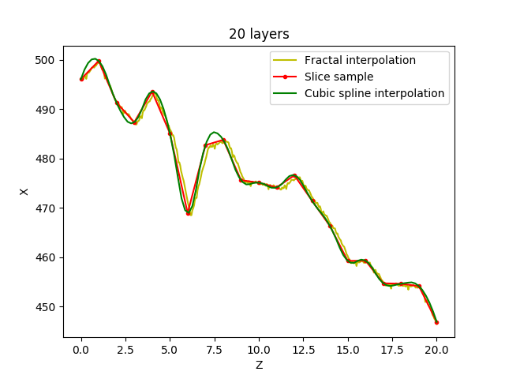
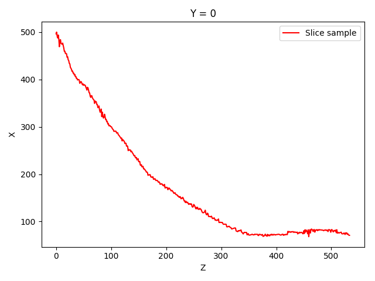
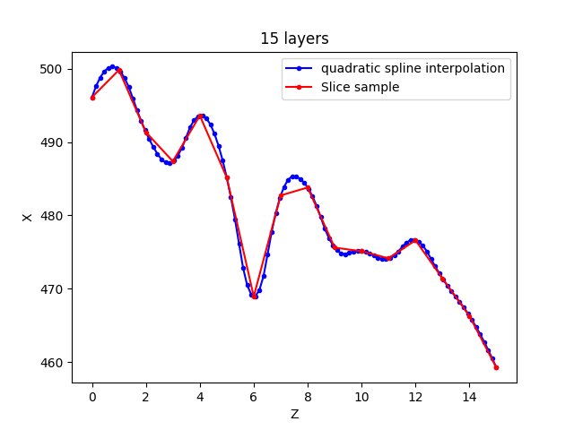
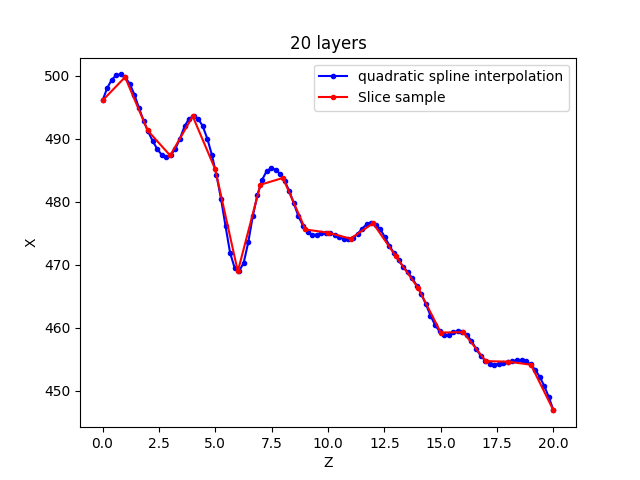

in **extract_z_axis.py**

- fractal_interpolation_demo

>绘制不同的样本点下分形插值

- combine_demo

>绘制不同的插值算法的比较(在不同的样本点数目下)

- raw_sample

>绘制一个采样切面

- drawSegmentFractal

>绘制分段分形插值, 并且保存成图片

------

in **cubic.py**

>绘制不同的样本点下三阶样条插值

